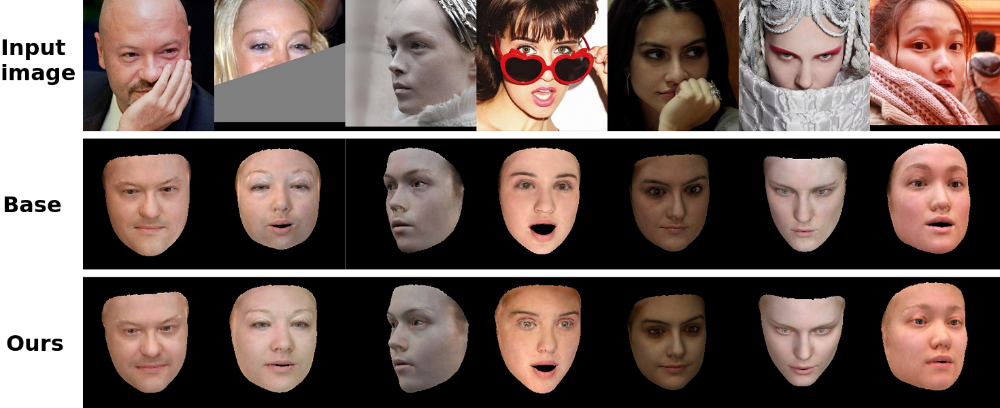
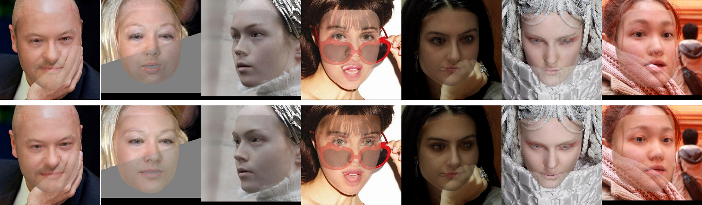
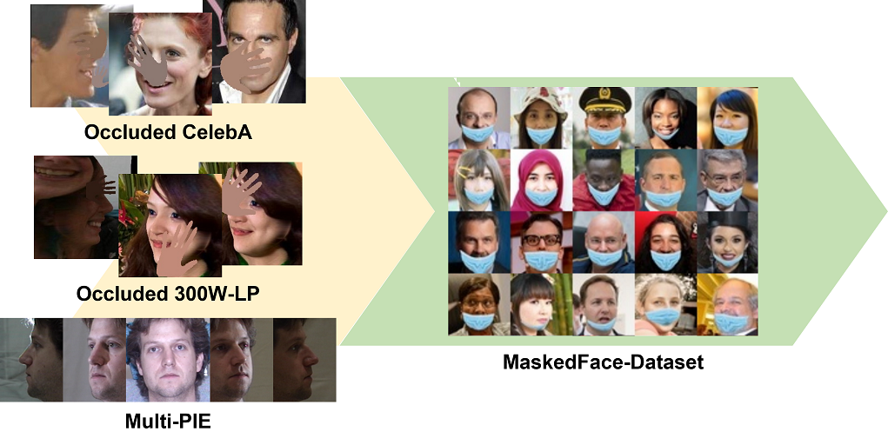

## Occlusion Robust 3D face Reconstruction

Code for Occlusion Robust 3D Face Reconstruction in **"Complete Face Recovery GAN: Unsupervised Joint Face Rotation and De-Occlusion from a Single-View Image (WACV 2022)"** [Link](https://github.com/yeongjoonJu/CFR-GAN)

> [Yeong-Joon Ju](https://github.com/yeongjoonJu), Gun-Hee Lee, [Jung-Ho Hong](https://github.com/KUMartin77?tab=repositories), and Seong-Whan Lee

**Abstract**

We propose our novel two stage fine-tuning strategy for occlusion-robust 3D face reconstruction. The training method is split into two training stages due to the difficulty of initial training for extreme occlusions. We fine-tune the **baseline** with our newly created datasets in the first stage and with teacher-student learning method in the second stage.

Our baseline is [Accurate 3D Face Reconstruction with Weakly-Supervised Learning: From Single Image to Image Set](https://github.com/microsoft/Deep3DFaceReconstruction) and we also referred this [code](https://github.com/changhongjian/Deep3DFaceReconstruction-pytorch). Note that we focus on alignments and colors for guidance of CFR-GAN in occluded facial images.

**Blended results**

First row is baseline results and second row is our results.

## Requirements

+ Python 3.7 or 3.8 can be used.

  ~~~bash
  pip install -r requirements.txt
  ~~~

+ Install the [Pytorch3D](https://github.com/facebookresearch/pytorch3d)==0.2.5

+ [Basel Face Model 2009 (BFM09)](https://faces.dmi.unibas.ch/bfm/main.php?nav=1-0&id=basel_face_model) and [Expression Basis (transferred from Facewarehouse by Guo et al.)](https://github.com/Juyong/3DFace). The original BFM09 model does not handle expression variations so extra expression basis are needed.
  
  + However, we made [BFM_model_80.mat](https://drive.google.com/file/d/1Y00xRDLKhx3oWJasdy-NdBp-wSh_uW0C/view?usp=sharing) (Dimension of id coef and tex coef is 80). Download and move it to mmRegressor/BFM folder.

## Inference

+ Download [our trained weights](https://drive.google.com/file/d/1nX70o-IMWNU5RZ-fVN98S-eLU6ihJ65L/view?usp=sharing) to saved_models folder

For alignment, You can use MTCNN or RetinaFace but we recommend to use [RetinaFace](https://github.com/biubug6/Pytorch_Retinaface).

~~~bash
git clone https://github.com/biubug6/Pytorch_Retinaface.git
Download weights
~~~

Estimate 3D faces from your images

~~~bash
python inference.py --img_path [your image path] --save_path [your save path] --model_path [WEIGHT PATH]
~~~

## Training with your dataset

#### Preprocessing:

Prepare your own dataset for data augmentation. The datasets used in this paper can be downloaded in follows:

+ Download links: [CelebA](http://mmlab.ie.cuhk.edu.hk/projects/CelebA.html), [300W-LP](http://www.cbsr.ia.ac.cn/users/xiangyuzhu/projects/3DDFA/main.htm), [Multi-PIE](https://drive.google.com/open?id=1QxNCh6vfNSZkod1Rg_zHLI1FM8WyXix4) (cropped version in [CR-GAN](https://github.com/bluer555/CR-GAN))

Except when the dataset has facial landmarks labels, you should predict facial landmarks. We recommend using [3DDFA v2](https://github.com/cleardusk/3DDFA_V2). If you want to reduce error propagation of the facial alignment networks, prepend **a flag** to filename. (ex) "pred"+[filename])

 In order to train occlusion-robust 3D face model, occluded face image datasets are essential, but they are absent. So, we create datasets by synthesizing the hand-shape mask.

~~~bash
python create_train_stage1.py --img_path [your image folder] --lmk_path [your landmarks folder] --save_path [path to save]
~~~

For first training stage, prepare `occluded` (augmented images), `ori_img` (original images), `landmarks` (3D landmarks) folders or modify folder name in `train_stage1.py`.

**\*\*You must align images with align.py\*\***

meta file format is:

~~~bash
[filename] left eye x left eye y right eye x right eye y nose x nose y left mouth x left mouth y ...
~~~

You can use MTCNN or RetinaFace

#### First Fine-tuning Stage:

Instead of skin mask, we use BiseNet, face parsing network. The codes and weights were modified and re-trained from [this code](https://github.com/zllrunning/face-parsing.PyTorch). <u>If you want to get more clear textures, use a skin detector of baseline.</u>

+ Download [weights of face parsing networks](https://drive.google.com/file/d/11yOlWD1fnrzJ8yAYIJJT96VFsRzSpRdh/view?usp=sharing) to faceParsing folder.
+ Download [weights of baseline 3D networks](https://drive.google.com/file/d/1H38pe61Zqz-7zVkYDrPQkfcosmhZp23n/view?usp=sharing) to mmRegressor/network folder.
+ Download [weights of face recognition networks](https://drive.google.com/file/d/1zkadw03OCxAbwJMTmP8436wpLrrK7ht9/view?usp=sharing) to saved_models folder. This network weight was specifically trained for stage1-training.

**Train occlusion-robust 3D face model**

~~~bash
python train_stage1.py
~~~

To show logs

~~~bash
tensorboard --logdir=logs_stage1 --bind_all --reload_multifile True
~~~

#### Second Fine-tuning Stage:

+ You can download MaskedFaceNet dataset in [here](https://github.com/cabani/MaskedFace-Net).
+ You can download FFHQ dataset in [here](https://github.com/NVlabs/ffhq-dataset).

**Train**

~~~bash
python train_stage2.py
~~~

To show logs

~~~bash
tensorboard --logdir=logs_stage2 --bind_all --reload_multifile True
~~~

#### Evaluation

~~~bash
python evaluation/benchmark_nme_aflw_2000.py
~~~

If you would like to evaluate your results, please refer `evaluation/estimate_aflw2000.py`
